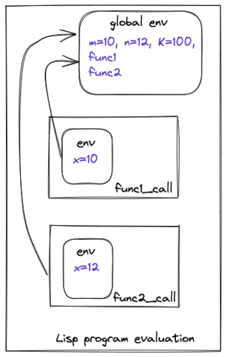

# Evaluator

Now comes the most exciting part of the project. Evaluation is the final step that will produce the result for the Lisp program. At a high level, the evaluator function recursively walks the List-based structure created by the parser and evaluates each atomic object and list (recursively), combines these results, and produces the final result. 

## Source

**eval.rs**

## Code Walk Through

Before walking through the evaluator code, it is important to explain the design of how variables and functions are implemented for the interpreter. 

### Variables

The variables are just *string* symbols assigned to values and they are created using the **define** keyword. Note a variable can be assigned atomic values such as integer or a boolean as well as function objects 

```Lisp
( 
  (define x 1) 
  (define sqr (lambda (r) (* r r))) 
)
```
This defines (or creates) two variables with the names x and sqr that represent an integer and string object respectively. Also, the scope of these variables lies within the *list object* that they are defined under. This is achieved by storing the mapping from the variable names (strings) to the objects in a map-like data structure as shown below.

```Rust
// env.rs
pub struct Env {
    parent: Option<Rc<RefCell<Env>>>,
    vars: HashMap<String, Object>,
}
```

The interpreter creates an instance of *Env* at the start of the program to store all of the variable definitions. In addition for every function call, the interpreter creates a new instance of env and uses the new instance to evaluate the function call. This new instance of env contains the function parameters as well as a *back* pointer to the *parent* env instance from where the function is called as shown below with an example

```Lisp
(
	(define m 10)
	(define n 12)
	(define K 100)
	
	(define func1 (lambda (x) (+ x K)))
	(define func2 (lambda (x) (- x K)))
	
	(func1 m)
	(func2 n)
)
```

   

This concept will become clearer as we will walk through the code


### Function Objects

Functions are represented by the Lambda Object which consists of two Lists (vectors). 

```Rust
Lambda(Vec<String>, Vec<Object>)
```

The first list is the list of parameters while the second list is the list of instructions forming the function definition. 

### Evaluator

The evaluator is implemented using the recursive *eval_obj* function. The *eval_obj* function takes the List object representing the program and the global *env* variable as the input. The function then starts processing the List object representing the program by iterating over each element of this list 

```Rust
fn eval_obj(obj: &Object, env: &mut Rc<RefCell<Env>>) 
	-> Result<Object, String> 
{
    match obj {
        Object::List(list) => eval_list(list, env),
        Object::Void => Ok(Object::Void),
        Object::Lambda(_params, _body) => Ok(Object::Void),
        Object::Bool(_) => Ok(obj.clone()),
        Object::Integer(n) => Ok(Object::Integer(*n)),
        Object::Symbol(s) => eval_symbol(s, env),
    }
}
```

In the case of the atomic objects such as an integer and boolean, the evaluator simply returns a copy of the object. In the case of the Void and Lambda (function objects), it returns the Void object. We will now walk through the *eval_symbol* and *eval_list* functions which implement most of the functionality of the evaluator.

### eval_symbol

The job of this function is to look up the Object bound to the symbol. This is done by recursively looking up in the passed *env* variable or any of its parent *env* until the root of the program. 

```Rust
let val = env.borrow_mut().get(s);
if val.is_none() {
    return Err(format!("Unbound symbol: {}", s));
}
Ok(val.unwrap().clone())
```

The bound object can be an atomic value such as an integer, boolean, or function object.

### eval_list

The *eval_list* function is the core of the evaluator and is implemented as shown below.

```Rust
let head = &list[0];
match head {
    Object::Symbol(s) => match s.as_str() {
        "+" | "-" | "*" | "/" | "<" | ">" | "=" | "!=" => {
            return eval_binary_op(&list, env);
        }
        "define" => eval_define(&list, env),
        "if" => eval_if(&list, env),
        "lambda" => eval_function_definition(&list),
        _ => eval_function_call(&s, &list, env),
    },
    _ => {
        let mut new_list = Vec::new();
        for obj in list {
            let result = eval_obj(obj, env)?;
            match result {
                Object::Void => {}
                _ => new_list.push(result),
            }
        }
        Ok(Object::List(new_list))
    }
}
```

This function peeks at the head of the list and if the head does not match the symbol object, it iterates all of the elements of the list recursively evaluating each element and returning a new list with the evaluated object values.

### Binary operations

If the head of the list matches a symbol, the list is evaluated on the basis of the type of the symbol. If the symbol matches a binary operation, for example 

```Lisp
(+ x y)
```
the *eval_binary_op* function calls the *eval_obj* on the second and third element of the list and performs the binary operation on the evaluated values.


### Variable definitions

If the head of the list matches the *define* keyword, for example

```Lisp
(define sqr (lambda (x) (* x x)))
```

the *eval_define* function calls *eval_obj* on the third argument of the list and assigns the evaluated object value to the symbol defined by the second argument in the list. The symbol and its object value are then stored in the current *env*. 

```Rust
let sym = match &list[1] {
    Object::Symbol(s) => s.clone(),
    _ => return Err(format!("Invalid define")),
};
let val = eval_obj(&list[2], env)?;
env.borrow_mut().set(&sym, val);
```

In the example above the symbol *sqr* and the function object representing the lambda will be stored in the current *env*. Once the function *sqr* has been defined in this manner, any latter code can access the corresponding function object by looking up the symbol *sqr* in *env*.

### If statement

If the head of the list matches the *if* keyword, for example

```Lisp
(if (> x y) (x) (y))
```

the *eval_if* function calls **eval_obj** on the second element of the list and depending upon whether the evaluated value is true or false, calls the eval_obj on the third or fourth element of the list and returns the corresponding value

```
let cond_obj = eval_obj(&list[1], env)?;
let cond = match cond_obj {
    Object::Bool(b) => b,
    _ => return Err(format!("Condition must be a boolean")),
};

if cond == true {
    return eval_obj(&list[2], env);
} else {
    return eval_obj(&list[3], env);
}
```

### Lambda
As mentioned earlier, the *lambda* (or function) object is consists of two vectors

```Rust
Lambda(Vec<String>, Vec<Object>)
```
The first vector represents the symbols forming the parameters and the second vector contains the list of objects forming the function body.

If the head of the list matches the *lambda* keyword, for example

```Lisp
(lambda (x) (* x x))
```
the *eval_function_definition* function evaluates the second element of the list as a vector of parameter names. 

```Rust
let params = match &list[1] {
    Object::List(list) => {
        let mut params = Vec::new();
        for param in list {
            match param {
                Object::Symbol(s) => params.push(s.clone()),
                _ => return Err(format!("Invalid lambda parameter")),
            }
        }
        params
    }
    _ => return Err(format!("Invalid lambda")),
};
```

The third element of the list is simply cloned as the function body.

```Rust
let body = match &list[2] {
    Object::List(list) => list.clone(),
    _ => return Err(format!("Invalid lambda")),
};
```

```Rust
Ok(Object::Lambda(params, body))
``` 

The evaluated parameter and body vector are returned as the *lambda* object

### Function Call


 

